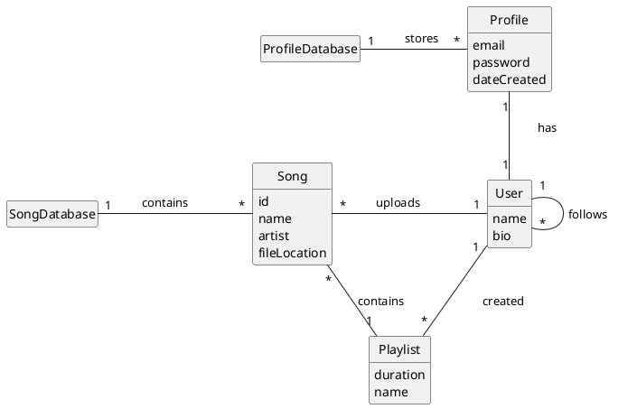
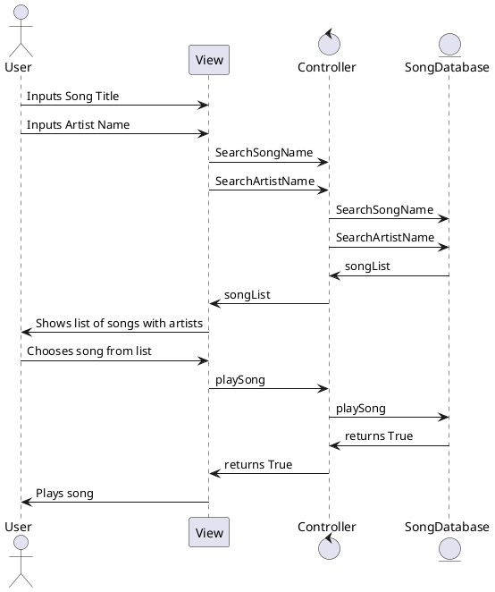
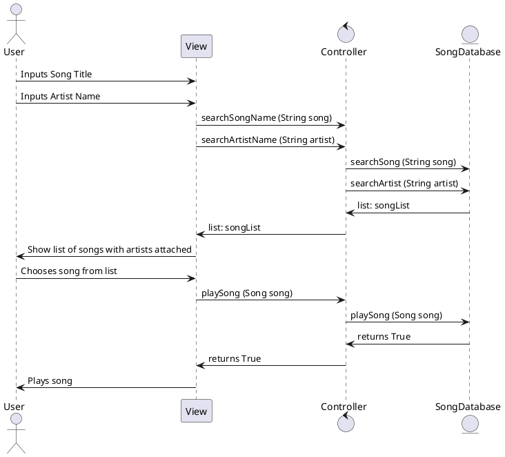
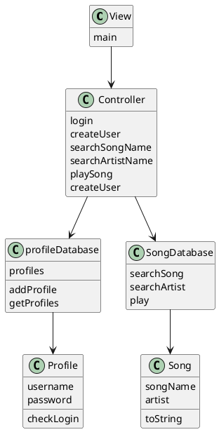

```plantuml
@startuml
'''Class Diagram

hide circle
hide empty methods
hide empty attributes

class User{
name
bio
}

class ProfileDatabase{
}

class Profile{
email
password
dateCreated
}

class SongDatabase{
}


class Song{
id
name
artist
fileLocation
}

class Playlist{
duration
name
}

User "1" -down- "*" Playlist : \t created \t
User "1" -left- "*" Song : \t uploads \t\t
User "1" - "*" User : follows \t

Profile "1" -down- "1" User : \t has \t
ProfileDatabase "1" -right- "*" Profile : \t stores \t

Playlist "1" -up- "*" Song : contains \t

SongDatabase "1" - "*" Song : \t contains \t\t
@enduml
```

```plantuml
@startuml
'''Play a song 

actor User
participant View
control Controller
entity SongDatabase


User -> View: Inputs Song Title
User -> View: Inputs Artist Name
View -> Controller: SearchSongName 
View -> Controller: SearchArtistName
Controller -> SongDatabase: SearchSongName
Controller -> SongDatabase: SearchArtistName
SongDatabase -> Controller: songList
Controller -> View: songList
View -> User: Shows list of songs with artists
User -> View: Chooses song from list
View -> Controller: playSong
Controller -> SongDatabase: playSong
SongDatabase -> Controller: returns True
Controller -> View: returns True
View -> User: Plays song

@enduml
```

```plantuml
@startuml
'''Play a song with input data

actor User
participant View
control Controller
entity SongDatabase


User -> View: Inputs Song Title
User -> View: Inputs Artist Name

View -> Controller: searchSongName (String song)
View -> Controller: searchArtistName (String artist)

Controller -> SongDatabase: searchSong (String song)
Controller -> SongDatabase: searchArtist (String artist)

SongDatabase -> Controller: list: songList 

Controller -> View: list: songList

View -> User: Show list of songs with artists attached

User -> View: Chooses song from list

View -> Controller: playSong (Song song)

Controller -> SongDatabase: playSong (Song song)

SongDatabase -> Controller: returns True

Controller -> View: returns True

View -> User: Plays song

@enduml
```

```plantuml
@startuml
'''Class Diagram
hide empty methods
hide empty attributes


class View{
{method} main
}

class Controller{
{method} login
{method} createUser
{method} searchSongName
{method} searchArtistName
{method} playSong
{method} createUser
}

class profileDatabase{
{field} profiles
{method} addProfile
{method} getProfiles
}

class Profile{
{field} username
{field} password
{method} checkLogin
}

class Song{
{field} songName
{field} artist
{method} toString
}

class SongDatabase{
{method} searchSong
{method} searchArtist
{method} play
}

View --> Controller
Controller --> profileDatabase
Controller --> SongDatabase
profileDatabase --> Profile
SongDatabase --> Song

@enduml
```